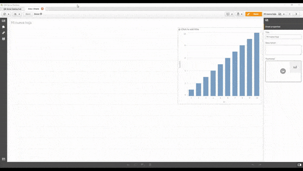

# Snow Effect
**Falling snow effect for QS**

## Instruccions ##

Download and copy the folder to

**C:\Users\\%USERNAME%\Documents\Qlik\Sense\Extensions**

then add the extension to the document (QS Desktop or browser)

You can define the characters and the color of the snowflakes (Actually it works with any character, try to put ❤)

You can also switch to let it snow inside!

## TODO ##
 -  Implement other parameters in the Settings panel, like min-size or wind

## Credits ##

Credits to **Josh McCarty <josh@joshmccarty.com>** and their excellent plugin https://github.com/joshmcrty/Flurry

Comments will be appreciated :)
